<p align="center">
  
</p>

# AWS Topology Monitor

Visualize your AWS load-balancer topology on an **n8n-style canvas** and drill
into per-target-group monitoring metrics (CPU / RAM / Storage / Request Count)
pulled from `node_exporter` via Prometheus.

```
ELB  ──▶  Target Group  ──▶  Servers (instances)
                │
                └── click header ──▶  metrics modal (CPU / RAM / Storage / Requests)
```

## Flow

1. Pick a **Load Balancer** from the dropdown.
2. The canvas draws the ELB, its **target groups** (grouped containers), and the
   **servers** inside each group (name, id, private IP, health).
3. **Click a target group header** → modal with live metric charts + range switch
   (15m / 1h / 6h / 24h), auto-refreshing every 15s.

## Run (mock data — no AWS needed)

**One command from the project root** (runs API + web together):

```bash
npm install      # installs concurrently at the root
npm run setup    # installs server/ + web/ deps
npm run dev      # starts API (:4000) + web (:5173) together
# open http://localhost:5173  (Vite proxies /api → :4000)
```

> `npm run dev` only works in `server/`, `web/`, or the **root** (via the root
> package.json above) — not in a folder without a package.json.

Or run them separately in two terminals:

```bash
cd server && npm install && npm run dev   # API on :4000
cd web    && npm install && npm run dev   # web on :5173
```

## Deploy with Docker Compose

Two containers: **api** (Node) + **web** (nginx serving the built UI and proxying
`/api` → api). SQLite persists on a named volume; the UI is same-origin so no CORS.

```bash
cp .env.example .env      # set AWS creds, ADMIN_PASSWORD, WEB_PORT, etc.
docker compose up -d --build
# open http://localhost:8080  (or WEB_PORT)
```

- **AWS credentials**: put keys in `.env`, or uncomment the `~/.aws` mount in
  `docker-compose.yml` to use your local profile.
- **Data**: users / sessions / saved views live in the `data` volume
  (`/app/data/data.db`), so they survive restarts.
- Change `ADMIN_PASSWORD` before deploying; the default admin is seeded on first run.
- To wire Prometheus, set `MOCK_METRICS=false` + `PROMETHEUS_URL` in `.env`.

### Single container (PaaS / Hormuz Dock)

For a platform that routes a domain → one container, the Node server can serve
the built UI *and* the API on one port (no nginx). Default port `8473`:

```bash
docker compose -f docker-compose.hormuz.yml up -d --build
# point Hormuz Dock at the container's 8473 (override with APP_PORT)
```

Same `.env` applies. The 2-container (nginx) setup above stays available for
non-PaaS deploys.

## Login & users

The app requires login. On first run a default admin is seeded (SQLite via
`node:sqlite`, no native deps) — override with `ADMIN_USERNAME` / `ADMIN_PASSWORD`:

```
admin / admin123    ← change after first login
```

- **Roles**: `admin` can manage users (create / list / delete) via the **⚙ Users**
  panel in the topbar; `user` can view topology + metrics only.
- All data endpoints require a valid session token (`Authorization: Bearer …`);
  tokens are opaque, stored in SQLite, and revoked on logout.
- Passwords are hashed with scrypt. DB file: `server/data.db` (git-ignored).

Auth endpoints: `POST /api/auth/login`, `POST /api/auth/logout`, `GET /api/auth/me`;
admin: `GET/POST /api/users`, `DELETE /api/users/:id`.

### `elbjump` — ELB → target group → instance → SSH

`scripts/elbjump` is a tshjump-style picker built on the API below: choose a
load balancer, then one of its target groups, then an instance, and it SSHes in
through the Teleport bastion. Needs `curl`, `jq`, `tsh`, and `fzf` (falls back
to a numbered menu without fzf).

**Install** — requires `tsh` (Teleport CLI) to be installed first; the
installer aborts with install instructions if it isn't. It then prompts for the
API key, your Teleport login and SSH user, and verifies the key against the
server before writing `~/.config/elbjump/.env`:

```bash
curl -fsSL https://raw.githubusercontent.com/OctopusRage/aws-topology-monitor/master/scripts/install-elbjump.sh | bash
```

Non-interactive: `ELBJUMP_API_KEY=… ELBJUMP_BASTION=me@awsjumpid.qiscus.io bash install-elbjump.sh`.

```bash
elbjump                                   # interactive, 3 pickers
elbjump qismo-stable                      # skip the ELB picker
elbjump qismo-stable qismo-api-longtimeout            # pick only the instance
elbjump qismo-stable qismo-api-longtimeout 10.30.1.5  # straight in (ip, name or id)
elbjump list [ELB]                        # print ELBs, or one ELB's TGs + IPs
elbjump --print … / --ip …                # show the ssh command / just the IP
```

Config keys in `~/.config/elbjump/.env`: `URL`, `API_KEY`, `SSH_USER`,
`BASTION` (empty = plain ssh), `USE_PUBLIC_IP=true`, `HEALTHY_ONLY=true`.

### Script access: ELB → target group → instance IPs

`GET /api/elb/targets` returns every load balancer with its target groups and the
registered instances (id, name, health, AZ, **privateIp**, **publicIp**). It's meant
for scripts — e.g. grab the IPs behind a target group and SSH into them.

Set `API_KEY` in `server/.env` (`openssl rand -hex 32`) and send it as
`X-API-Key: <key>` or `Authorization: Bearer <key>`; no login session needed.
The key has plain `user` (read-only) rights. A normal session token works too.

| Query | Effect |
|-------|--------|
| `lb=<name or ARN>` | only that load balancer |
| `tg=<name or ARN>` | only that target group |
| `health=healthy` | only targets in that health state (`healthy`, `unhealthy`, `draining`, …) |
| `format=text` | one IP per line instead of JSON |
| `ip=public` | with `format=text`, print public IPs (default: private) |

Two-step flow for pickers: `GET /api/elbs` lists the load balancers, then
`GET /api/elb/targets?lb=<name>` returns that one ELB's target groups and
instances (only that ELB is described on AWS).

```bash
# JSON tree of everything
curl -s -H "X-API-Key: $KEY" https://host/api/elb/targets | jq

# SSH into every healthy instance behind one target group
for ip in $(curl -s -H "X-API-Key: $KEY" \
    "https://host/api/elb/targets?tg=api-gateway&health=healthy&format=text"); do
  ssh ec2-user@"$ip" uptime
done
```

## Go live

Edit `server/.env` (copy from `.env.example`):

| Var | What it does |
|-----|--------------|
| `USE_AWS=true` | Read real ELBs/target groups/instances via AWS SDK v3. Uses the standard credential chain (env keys, profile, or instance role). |
| `API_KEY=…` | Static key for scripts to call the API (e.g. `/api/elb/targets`) without a login session. Unset = disabled. |
| `AWS_REGION` | Region to query. |
| `MOCK_METRICS=false` | Query Prometheus for real instead of synthesizing series. |
| `PROMETHEUS_URL` | Prometheus that scrapes your `node_exporter`s. |
| `NODE_EXPORTER_PORT` | Port in the `instance` label (default `9100`). Instances are matched to series by **private IP** (`<privateIp>:9100`). |
| `ROOT_MOUNT` | Filesystem mount for the Storage metric (default `/`). |
| `USE_CLOUDWATCH_REQUESTS=true` | Pull the **Request Count** panel from CloudWatch's native ALB `RequestCount` metric (per target group) instead of the node_exporter proxy. Needs AWS creds + real ARNs. CPU/RAM/Storage still come from Prometheus. Panel shows a `cloudwatch` badge. |

If Prometheus is unreachable, the API falls back to sample series so the UI still
renders (badge shows `mock-fallback`).

## PromQL used

- **CPU** — `100 - rate(node_cpu_seconds_total{mode="idle"}[5m])*100`
- **Memory** — `(1 - node_memory_MemAvailable_bytes / node_memory_MemTotal_bytes)*100`
- **Storage** — `(1 - node_filesystem_avail_bytes / node_filesystem_size_bytes)*100` at `ROOT_MOUNT`
- **Request Count** — `sum(rate(node_network_receive_packets_total[5m]))` *(node_exporter proxy)*, **or** CloudWatch `AWS/ApplicationELB` `RequestCount` (Sum ÷ period → req/s) per target group when `USE_CLOUDWATCH_REQUESTS=true` *(recommended for real request volume)*

## Architecture

```
server/                 Express API (ESM, node fetch)
  config.js             env + toggles
  providers/
    mockProvider.js     demo topology
    awsProvider.js      live AWS SDK v3 (elbv2 + ec2) — same shape as mock
  prometheus.js         PromQL queries + mock/fallback series
  index.js              /api/elbs, /api/elb/targets, /api/topology, /api/metrics/target-group
web/                    React + Vite
  layout.js             topology → React Flow nodes/edges (ELB→TG→servers)
  components/nodes.jsx   custom ELB / target-group / server nodes
  components/MetricsModal.jsx  Recharts panels + range switch
  App.jsx               canvas (React Flow: background, controls, minimap)
```
